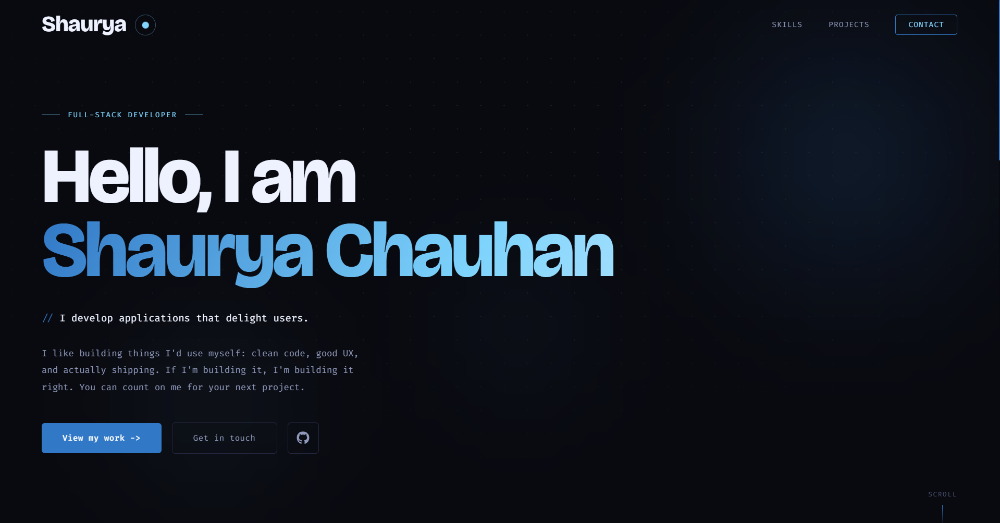

# ⭐ Shaurya's Portfolio

Personal portfolio website built with Next.js and TypeScript, showcasing my projects, skills, and a contact form.

🌐 **Live:** [shauryadev.in](https://shauryadev.in)

If you liked it, consider leaving a ⭐

## 🖼️ Preview

## 🛠️ Tech Stack

- **Fonts:** Bricolage Grotesque, Fira Code
- **Forms:** Formspree

## 📬 Contact

- **Email:** blues9524@gmail.com
- **GitHub:** [@shaurya9524](https://github.com/shaurya9524)
- **LinkedIn:** [shaurya-chauhan-119b3526b](https://linkedin.com/in/shaurya-chauhan-119b3526b)
- **Discord:** [shaurya_chauhan](https://discord.com/users/893705256368750592)
- **Discord Server:** [Shadow's Den](https://discord.gg/7gtXphYbPq)
- **X:** [Shaurya9524](https://x.com/Shaurya9524)